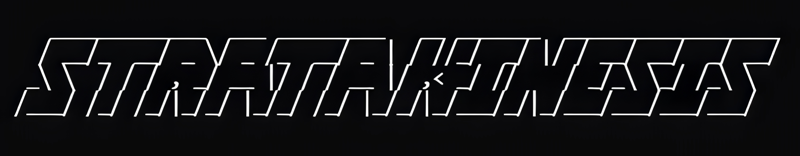

# STRATA — Engineered with Stratakinesis



**Strata** is a deterministic, rigging-first 2D engine library for Python.
pygame-ce for rendering · pymunk for physics · numpy / cupy for batch math.

---

## What it does

- **Deterministic physics** — fixed-timestep accumulator, never variable dt. Same inputs = same simulation, every time.
- **Continuous collision detection** — adaptive substep CCD prevents fast objects from tunnelling through thin walls.
- **Rig assembly system** — six production-ready rigs out of the box: `PendulumRig`, `ChainRig`, `RopeRig`, `GearTrainRig`, `LeverRig`, `HingeMotorRig`. Drop them into a scene with one call.
- **Soft bodies** — spring-mass meshes with structural/shear/bending tiers, pressure simulation, and COM correction. Deform, squish, bounce.
- **Minimal ECS** — Entity (int ID + component dict), World/Scene, ordered systems pipeline. No magic. No global state.
- **Render interpolation** — sub-step alpha lerp with shortest-path angle interpolation so motion is silky at any frame rate.
- **Timestamped input buffer** — events are stamped with `time.monotonic()` and delivered to the exact physics step they belong to.
- **Per-body damping** — `linear_damping` / `angular_damping` on every `Physics` body. Pendulums decay naturally. No global drag hacks.
- **Named collision groups** — `group="player"`, `collides_with="enemy"` — readable string-based filtering instead of raw bitmasks.
- **Sprite.image(path)** — blit a loaded image aligned to body Transform with auto aspect ratio and optional physics collision.
- **Constraint visualiser** — `show_constraints=True` overlays every pymunk joint as a coloured debug shape: springs as zigzags, gears as dotted lines, pins/pivots as circles.
- **Scene serialisation** — `game.save_scene(path)` / `game.load_scene(path)` — full round-trip JSON save/load of entities, components, physics state, and gravity.
- **Hook API** — `on_event`, `on_update`, `on_fixed_update`, `on_draw`. Zero subclassing. Assign a function and go.
- **F3 debug overlay** — FPS, entity count, physics steps, gravity, vsync status, platform info.
- **WSL-aware** — auto-detects WSLg, disables vsync, caps at 240 fps.

---

## Quick start

```bash
python -m venv .venv
source .venv/bin/activate
pip install -e ".[gpu]"   # or: pip install -e .

python examples/demo_basic.py
python examples/demo_joints.py
python examples/demo_soft_body.py
```

---

## 10-line bouncing ball

```python
from strata import Game, Sprite

game = Game(window_size=(1280, 720))
ball   = Sprite.circle(radius=1.0, x=0.0, y=5.0, density=1.0)
ground = Sprite.rect(width=20.0, height=0.5, y=-4.0, static=True)

game.scene.add_entities(ball, ground)
game.run()
```

All values are **world units** (16×9 default viewport). Camera handles scale-to-fit. Window is resizable.

---

## Rig system (v0.4)

Rigs are assembled constraint graphs. One call creates bodies, joints, and motors; everything is registered automatically when you call `scene.add_rig()`.

```python
from strata.rigs import PendulumRig, GearTrainRig, ChainRig

# Double pendulum with natural decay
pend = PendulumRig(length=2, arm_length=1.8, anchor=(0, 4), damping=0.993)
game.scene.add_rig(pend)

# Three interlocking gears with trapezoidal teeth, motor-driven
gears = GearTrainRig(radii=[0.75, 0.45, 0.60], x=0, y=-3, motor_rate=3.0)
game.scene.add_rig(gears)
game.on_draw = lambda surf, cam: gears.draw(surf, cam)

# 7-link hanging chain
chain = ChainRig(length=7, start_x=3, start_y=4, anchor=(3, 4), damping=0.991)
game.scene.add_rig(chain)
```

| Rig | Physics | Visual |
|---|---|---|
| `PendulumRig` | PinJoint chain, per-body damping | bob circles (+ optional rod via `draw()`) |
| `ChainRig` | Vertical PinJoint chain, top-edge pivots | rectangular links |
| `RopeRig` | SlideJoint chain (slack/sag) | circle beads |
| `GearTrainRig` | GearJoints, SimpleMotor | parametric trapezoidal teeth via `gfxdraw` |
| `LeverRig` | PivotJoint + RotaryLimit | rectangular plank |
| `HingeMotorRig` | PivotJoint + SimpleMotor | any entity |

---

## Soft bodies

```python
blob = Sprite.soft_circle(
    radius=1.2, x=0, y=3,
    rings=4, segments=12,
    stiffness=400, damping=12,
    pressure=90,
)
game.scene.add_entity(blob)
```

Soft bodies use a three-tier spring network (structural → shear → bending) with a centre-of-mass correction pass each substep to prevent energy blowup at high stiffness.

---

## Hook API

| Hook | Fires | Use for |
|---|---|---|
| `game.on_event(event)` | Every pygame event | UI, menu toggles |
| `game.on_update(dt)` | Every render frame | Key polling, HUD, camera |
| `game.on_fixed_update(dt, events)` | Every physics step | Discrete input, physics-affecting logic |
| `game.on_draw(surface, camera)` | After `scene.draw()`, before F3 overlay | Custom gfxdraw, rig visuals |

All hooks are optional callables. Assign or leave `None`.

---

## Architecture

```
strata/
  __init__.py              # exports: Game, Sprite, CollisionGroups
  config.py                # WORLD_WIDTH/HEIGHT, FIXED_DT, MAX_FRAME_TIME
  backend/array.py         # xp = cupy | numpy
  core/
    clock.py               # Clock: tick() + fps
    collision_groups.py    # Named collision group → bitmask registry
    input_buffer.py        # StampedEvent, InputBuffer
    loop.py                # Game, Scene, run loop, hooks, F3 overlay
    serialise.py           # save_scene / load_scene (JSON round-trip)
  ecs/
    entity.py              # Entity (int ID + component dict)
    components.py          # Transform, Physics, Visual, SoftBody, PropertyBinding
    world.py               # World (entity registry + systems)
  systems/
    base.py                # System base class
    physics_system.py      # pymunk.Space, fixed-step, CCD, per-body damping, transform sync
    soft_body_system.py    # spring-mass registration, velocity func, COM correction
    render_system.py       # gfxdraw, interpolation, viewport culling, image blitting
    binding_system.py      # PropertyBinding mirroring
    debug_draw.py          # Constraint visualiser overlay
  render/camera.py         # scale-to-fit, world_to_screen, screen_to_world
  shapes/
    factory.py             # Sprite.circle/rect/polygon/image/soft_circle/soft_rect
    mesh.py                # Mesh generation (circle, rect, polygon vertex arrays)
  rigs/
    base.py                # Rig + JointHandle (constraint spec → pymunk)
    pendulum.py            # PendulumRig
    chain.py               # ChainRig
    rope.py                # RopeRig
    gear_train.py          # GearTrainRig
    gear_utils.py          # gear_polygon(), select_num_teeth(), initial_tooth_phases()
    lever.py               # LeverRig
    hinge_motor.py         # HingeMotorRig
examples/
  demo_basic.py            # Ball + ground
  demo_motor.py            # Motor wheel + input
  demo_joints.py           # All six rigs in one scene
  demo_soft_body.py        # Soft-body meshes
  demo_collisions.py       # Collision callbacks
  demo_ccd.py              # Continuous collision detection
  demo_soft_collisions.py  # Soft body + rigid collisions
tests/                     # 300 tests
```

55 Python files · ~10 100 LOC · 300 tests · 7 demos

---

## Systems pipeline (each fixed step)

1. **PhysicsSystem** — `space.step()` × substeps, per-body `linear_damping` / `angular_damping`, Transform sync
2. **SoftBodySystem** — COM correction hook run inside each substep
3. **BindingSystem** — PropertyBinding mirroring (reads fresh post-physics Transforms)
4. **RigSystem** — lazy constraint registration for newly added rigs
5. **RenderSystem** — interpolated draw (`alpha = accumulator / FIXED_DT`), shortest-path angle lerp, viewport culling

---

## Config

| Constant | Default | Meaning |
|---|---|---|
| `WORLD_WIDTH` | `16.0` | World units across viewport |
| `WORLD_HEIGHT` | `9.0` | Derived from aspect ratio |
| `FIXED_DT` | `1/60` | Physics timestep (s) |
| `MAX_FRAME_TIME` | `0.25` | Spiral-of-death clamp |

---

## Controls (built-in)

| Key | Action |
|---|---|
| `ESC` | Quit |
| `F3` | Toggle debug overlay |

---

## Design constraints

- `FIXED_DT` is the only physics timestep. No variable stepping.
- Aspect ratio and world dimensions are immutable after boot.
- Visual vertex arrays are cached at entity creation. Never rebuilt per frame.
- `mass = density × area`. pymunk moment helpers compute inertia.
- Rigs are pure data + constraint specs. No simulation logic lives in rig classes.
- Damping is per-body and multiplicative, applied once per fixed step after `space.step()`.
- Input goes through `InputBuffer`. Raw pygame event polling in userland is discouraged.

---

## Dependencies

| Package | Purpose |
|---|---|
| `pygame-ce` | Rendering, window, events |
| `pymunk` | 2D rigid-body physics (Chipmunk) |
| `numpy` | Array math (default backend) |
| `cupy` *(optional)* | GPU-accelerated array math |

---

## Tests

```bash
SDL_VIDEODRIVER=dummy SDL_AUDIODRIVER=dummy .venv/bin/pytest tests/ -q
```

251 passing. Covers: accumulator determinism, ECS CRUD, camera math, physics sync, CCD, rig constraint assembly, soft-body registration, mesh generation, input buffer delivery, collision events, hook wiring, entity lifecycle, damping API.

---

## What's next

See [VISION.md](VISION.md) for the full roadmap.

---

## License

MIT

---

**Engineered with Stratakinesis**
